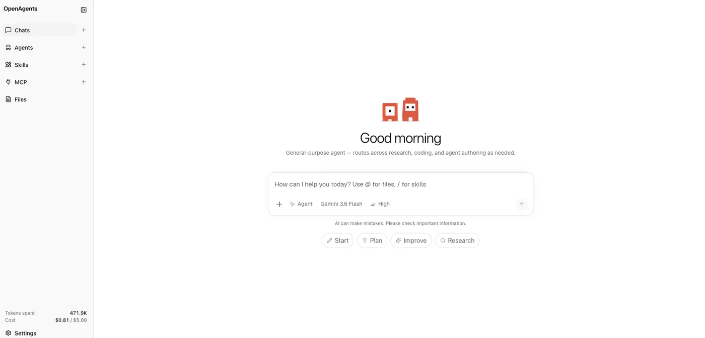

# OpenAgents

Self-hostable agent workspace specialized via Agents.

Pick an agent (or build one), chat with a deep agent over AG-UI, optionally edit a markdown document with Accept/Reject suggestions, and run tools in a local or Docker sandbox — on your machine or a VPS.



Built on [Pydantic AI](https://ai.pydantic.dev/) and the deep-agent harness from [pydantic-deepagents](https://github.com/vstorm-co/pydantic-deepagents). OpenAgents layers a full product workspace on that stack: AG-UI, Agents, documents, MCP, Admin, and multi-user auth.

## Architecture

OpenAgents builds on [pydantic-deepagents](https://github.com/vstorm-co/pydantic-deepagents) and [Pydantic AI](https://ai.pydantic.dev/): planning, filesystem tools, subagents, skills, memory, hooks, summarization, and cost tracking are deep-agent capabilities. OpenAgents wraps that core in a product workspace — AG-UI, Agents, documents, MCP, Admin, and multi-user auth/storage.

```
                              OpenAgents
+---------------------------------------------------------------------------+
|                                                                           |
|   Web (Next.js · AG-UI)  <------------------>  API (FastAPI)              |
|                                                      |                    |
|   +----------+ +----------+ +----------+ +--------+ +----------+ +-----+  |
|   | Planning | |Filesystem| | Subagents| | Skills | |  Agents  | |Docs |  |
|   +----+-----+ +----+-----+ +----+-----+ +---+----+ +----+-----+ +--+--+  |
|        |            |            |           |           |          |     |
|        +------------+-----+------+-----------+-----------+----------+     |
|                           |                                               |
|                           v                                               |
|  Summarization --> +------------------+ <-- Hooks · security              |
|  Cost tracking --> |    Deep Agent    | <-- Memory                        |
|  OpenRouter    --> | (pydantic-ai ·   | <-- MCP · image gen               |
|  models        --> |  pydantic-deep)  |                                   |
|                    +--------+---------+                                   |
|                             |                                             |
|           +-----------------+-----------------+                           |
|           v                 v                 v                           |
|    +------------+    +------------+    +------------+                     |
|    | Workspace  |    |   Local    |    |   Docker   |                     |
|    | state · DB |    |  backend   |    |  sandbox   |                     |
|    +------------+    +------------+    +------------+                     |
|                                                                           |
+---------------------------------------------------------------------------+
```

## Quickstart

### Option A — Docker Compose

```bash
cp .env.example .env
# set OPENROUTER_API_KEY=sk-or-...
docker compose up --build
```

Open [http://localhost:3000](http://localhost:3000). The API listens on `:8000` with SQLite and open auth (`AUTH_MODE=none`, user `dev-user`).

### Option B — Local (uv + pnpm)

**API**

```bash
cd apps/api
cp .env.example .env
# set OPENROUTER_API_KEY=...
uv sync
uv run uvicorn openagents_api.main:app --reload --port 8000
```

**Web** (second terminal)

```bash
cd apps/web
echo "NEXT_PUBLIC_API_URL=http://localhost:8000" > .env.local
pnpm install
pnpm dev
```

Open [http://localhost:3000](http://localhost:3000).

On first boot with an empty database, OpenAgents seeds one sample workspace per built-in agent for the open-auth user.

## Auth and database (Supabase)

For production or multi-user installs, OpenAgents can use [Supabase](https://supabase.com/) for **authentication** and optionally for the **Postgres** database that stores workspaces, threads, and messages.

| Concern | Local default | Production option |
|---------|---------------|-------------------|
| Sign-in | `AUTH_MODE=none` | [Supabase Auth](https://supabase.com/auth) (`AUTH_MODE=supabase`) |
| App data | SQLite | [Supabase Postgres](https://supabase.com/database) via `DATABASE_URL` |

Auth and the app database are **independent**: enabling Supabase Auth alone does not move chat data off SQLite. You can use either or both. Setup details: [docs/configuration.md](docs/configuration.md#auth--database-supabase).

## Agents

An **Agent** is a folder that specializes the workspace agent: persona, skills, optional document template, and tool-group hints.

```
agents/<slug>/
  agent.yaml           # name, description, icon, uses_document, predefined_skills, …
  agent.md             # required persona / operating instructions
  soul.md              # optional tone
  system_prompt.md     # optional; falls back to an OpenAgents default
  templates/
    document.md        # when uses_document: true
  skills/
    <skill-slug>/
      SKILL.md
```

**Library skills** live under repo `skills/` (and user skills in the sidebar). Agents can mark library skills as **predefined** so their bodies are rooted in the system prompt; every agent can still load the full library on demand (`/` in chat).

See [docs/agents.md](docs/agents.md), [docs/skills.md](docs/skills.md), and [docs/mcp.md](docs/mcp.md).

### Built-in agents

| Agent | Slug | Document | Canvas |
|------|------|----------|--------|
| Agent | `agent` | Yes | Yes |
| Research Assistant | `research-assistant` | Yes | Yes |
| Coding Assistant | `coding-assistant` | No | No |
| Agent Builder | `agent-builder` | No | No |

## Key features

OpenAgents is an **agent workspace** — the product layer around a deep agent harness. The model provides intelligence; the workspace provides planning, tools, memory, documents, MCP, sandboxed execution, and spend controls.

| | Feature | What you get |
|--|---------|--------------|
| 💬 | **AG-UI chat** | Streaming agent UI over SSE — text, thinking, tools, and media |
| 🧩 | **Agents** | Folder- or UI-defined specialists (`agent.md`, skills, MCP, optional document) |
| 📝 | **Document HITL** | Markdown editor with `suggest_edit` Accept/Reject and clarifying questions |
| 🎨 | **Excalidraw canvas** | Live Artifacts whiteboard for architecture, flowcharts, comparisons, brainstorms |
| 🔧 | **Tool-calling** | File read/write/edit, shell (sandbox), glob/grep, uploads, document parse |
| 🤝 | **Subagents + plan** | Deep builtins for plan mode, todos, and subagent delegation when enabled |
| 🧠 | **Persistent memory** | `MEMORY.md` / persona files seeded per workspace and injected into runs |
| ♾️ | **Long context** | Auto-summarization near the model token budget |
| 🐳 | **Sandboxed execution** | `local` or `docker` sandbox; soft-degrades to filesystem-only when busy |
| 📚 | **Skills system** | On-demand `SKILL.md` playbooks; library + predefined skills; `/` mentions |
| 📄 | **Document parsing** | PDF/DOCX/XLSX/PPTX and images via LiteParse (optional OCR) |
| 🔌 | **MCP** | Attach HTTP MCP servers — Firecrawl, OpenRouter, or your own |
| 🖼️ | **Image generation** | Via OpenRouter MCP; results become durable assets in chat |
| 🔐 | **Supabase-ready** | Optional [Supabase Auth](https://supabase.com/auth) and [Postgres](https://supabase.com/database) |
| 🛡️ | **Security presets** | Filesystem hooks + optional prompt-injection / secret-redaction / tool-guard |
| 💰 | **Cost tracking** | Token + USD spend per run, sidebar totals, hard budget limits |
| 🌐 | **OpenRouter-first models** | Admin model tiers and ZDR; any pydantic-ai model id when keys are present |
| ⚙️ | **Admin panel** | Tool groups, sandbox/runtime, models, safety toggles, optional signup queue |

## Documentation

| Doc | Topic |
|-----|--------|
| [docs/configuration.md](docs/configuration.md) | Environment variables; auth; SQLite vs Supabase Postgres |
| [docs/agents.md](docs/agents.md) | Authoring Agents (wizard, predefined skills) |
| [docs/skills.md](docs/skills.md) | Library skills, icons, `/` mentions, API |
| [docs/mcp.md](docs/mcp.md) | MCP library, image generation, attach to agents |
| [docs/sandbox.md](docs/sandbox.md) | Local vs Docker sandbox |
| [docs/deployment.md](docs/deployment.md) | Compose and VPS deployment |
| [docs/admin-panel.md](docs/admin-panel.md) | Admin UI |
| [docs/evals.md](docs/evals.md) | Agent eval harness |
| [docs/adr/](docs/adr/) | Architecture decision records |

## Roadmap

- **Live run forking** — split a run into isolated branches, try different approaches, pick a winner
- **Checkpoints** — save conversation state, rewind, and fork sessions from any point
- **Richer subagents** — named / builtin subagent configs, nesting controls, and clearer team coordination in the UI
- Cloud sandbox providers (e.g. Daytona / Modal) behind the existing sandbox interface
- Import agents from a GitHub repo or URL
- Global / shared skills outside a single agent
- Richer agent marketplace UX and versioning
- Payment gateway for spend budgets (today: soft cap via `DEFAULT_SPEND_BUDGET_USD`)

## Contributing

See [CONTRIBUTING.md](CONTRIBUTING.md). Pull requests and agent contributions are welcome.

## License

[MIT](LICENSE) © 2026 Shahab Pourazadi
